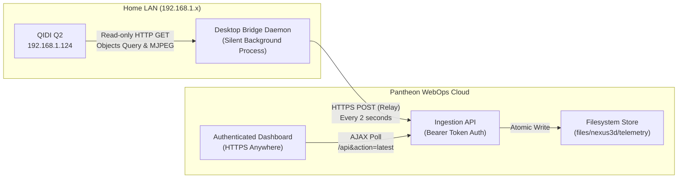

# NEXUS 3D — Remote Fleet Telemetry & Monitoring System

A next-generation, non-invasive 3D printer monitoring and telemetry application built for Klipper/Moonraker printers, powered by a **two-tier architecture**:

1. **Pantheon Cloud Web App** (PHP 8.2 backend + HTML/JS/CSS frontend)
   - Secure session-based authentication protecting all routes (`admin` / `nexus3d`).
   - Dynamic telemetry ingestion API (`/index.php?route=api&action=push`).
   - High-performance, zero-latency JPEG snapshot delivery over HTTPS.
   - Sleek Dark / Light theme toggle with state persistent in `localStorage`.
   - Polished circular temperature gauges with zero clipping and state-synchronized progress animation.
   - Fleet expansion slot ready for future printers.

2. **Local Desktop Bridge Daemon** (Zero-Dependency Python 3.8+)
   - **Zero printer modifications**: No firmware, Klipper configs, or Moonraker files are modified on any printer.
   - Passively polls read-only HTTP GET endpoints on your LAN (`192.168.1.124` QIDI Q2).
   - Captures live webcam snapshots and relays them via Bearer-authenticated HTTPS POSTs to Pantheon.
   - Cross-platform: Runs silently in the background on Windows, macOS, or Linux/Raspberry Pi.
   - **All-in-One USB Installer Wizard**: Includes automated portable Python runtime downloader, interactive setup wizard, connectivity diagnostics, and automatic Windows Startup / Linux systemd service registration.

---

## 🏗️ Architecture & Data Flow



---

## ⚡ Quick Start: 1-Click USB Installer

You only need to run the installer **once** on any computer connected to the same Wi-Fi / LAN as your QIDI Q2 printer:

1. Copy the `installer_usb/` folder to a USB drive or directly to the LAN desktop.
2. Run the installer:
   - **Windows**: Double-click `install.bat`
   - **Linux / Raspberry Pi**: Run `sudo bash install.sh`
3. The Setup Wizard will:
   - Verify Python (automatically downloads portable runtime if missing).
   - Pre-fill smart defaults for your Pantheon URL, API token, and QIDI Q2 IP (`192.168.1.124`).
   - Run live diagnostic probes against your printer, webcam, and Pantheon.
   - Register the bridge to start automatically on system boot.
   - Launch the bridge daemon immediately!

---

## 🌐 Accessing Your Cloud Dashboard

Open your Pantheon URL on any browser, mobile phone, or laptop worldwide:
```
https://dev-nexus3-d.pantheonsite.io/
```

- **Default Username**: `admin`
- **Default Password**: `nexus3d`

---

## 📂 Project Structure

```
TestProject/
├── index.php                 # Central router & session auth gateway
├── dashboard.html            # Authenticated fleet monitoring dashboard
├── login.html                # Branded login interface
├── app.js                    # Telemetry rendering, theme toggle & polling logic
├── style.css                 # Dark & Light theme styling system
├── pantheon.yml              # Pantheon deployment & path protection rules
├── assets/                   # Static thumbnails & brand assets
├── private/
│   ├── config.php            # Security secrets, API token, filesystem paths
│   ├── auth.php              # Login credentials verification & session setter
│   └── api.php               # Ingestion (push), query (latest), & snapshot serve
└── installer_usb/
    ├── install.bat           # Self-contained single-file installer & setup wizard
    ├── uninstall.bat         # Self-contained single-file uninstaller & service removal
    ├── bridge_daemon.py      # Standalone passive relay daemon (zero external dependencies)
    ├── start_bridge.bat      # Manual background launcher
    ├── stop_bridge.bat       # Process stopper
    ├── status.bat            # Live status & log inspector
    ├── enable_autostart.bat  # Enable Windows automatic startup
    ├── disable_autostart.bat # Disable Windows automatic startup
    ├── config.env.example    # Configuration reference
    └── README_USB.txt        # Plain-text flash drive documentation
```

---

## 🔒 Security & Non-Invasive Guarantees

- **No Printer Modifications**: Printers remain 100% stock with factory security policies intact.
- **Ingestion Protection**: Bridge-to-cloud telemetry writes require a shared secret Bearer API token.
- **Frontend Protection**: The web dashboard is strictly gated behind bcrypt-hashed password sessions.
- **Zero Mixed-Content Errors**: Camera snapshots are delivered directly over HTTPS from Pantheon.
